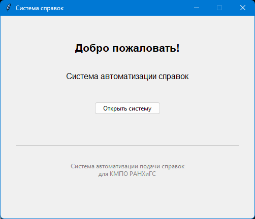
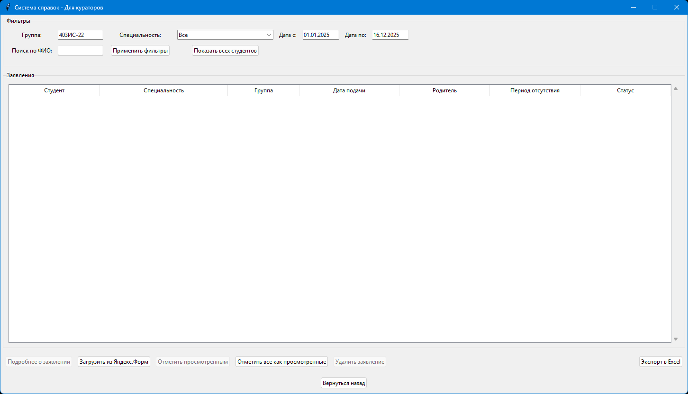
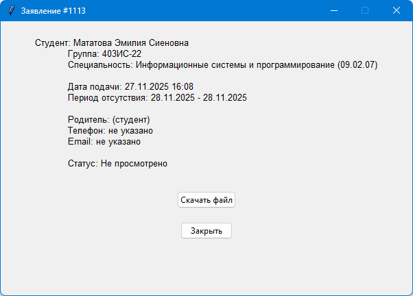

# 🏥 Система обработки справок для кураторов

Десктопное приложение для автоматизации процесса обработки справок об отсутствии студентов в учебных заведениях. Система позволяет кураторам эффективно управлять заявлениями студентов, импортировать данные из Яндекс.Форм, отслеживать статусы и экспортировать отчеты.

---

## ✨ Возможности

* 📊 **Просмотр и фильтрация заявлений** с настройками поиска
* 🔄 **Автоматический импорт данных** из Яндекс.Форм
* 📁 **Управление прикрепленными файлами** справок
* 📈 **Экспорт данных в Excel** для отчетности
* 🏷️ **Система статусов** заявлений (просмотрено/не просмотрено)
* 🔍 **Расширенный поиск** по всем параметрам заявлений

---

## 🛠 Технологии

### Backend

* **Python** — язык программирования
* **SQLite** — встроенная база данных
* **pandas** — обработка данных и экспорт в Excel
* **requests** — запросы к API Яндекс.Форм

### Frontend

* **Tkinter** — графический интерфейс
* **ttk** — компоненты интерфейса

---

## 📁 Структура проекта

```
program_for_curators/
├── main.py                             # Вход в приложение
├── database.py                         # Модуль работы с базой данных
├── yandex_import.py                    # Импорт данных из Яндекс.Форм
├── welcome_window.py                   # Стартовое окно приложения
├── curator_window.py                   # Основное окно куратора
├── requirements.txt                    # Список всех необходимых библиотек 
├── .env                                # Пример файла конфигурации
├── certificates.db                     # Пример локальной базы данных
├── Руководство пользователя.pdf        # Руководство пользователя
└── README.md                           # Это описание
```

---

## 🚀 Быстрый старт

### Предварительные требования

* Python 3.8 или выше
* pip (менеджер пакетов Python)

### Установка

1. Установите зависимости:

```bash
pip install -r requirements.txt
```

2. Настройте окружение:

```bash
.env
# Отредактируйте .env файл, добавив свои настройки
```

3. Запустите приложение:

```bash
start.bat
```

---

## 📖 Использование

### Основной рабочий процесс

1. **Запуск приложения**: откройте программу и войдите в систему куратора
2. **Импорт данных**: загрузите новые заявления из Яндекс.Форм
3. **Просмотр заявлений**: используйте фильтры для поиска нужных записей
4. **Обработка**: отмечайте заявления как просмотренные или удаляйте обработанные
5. **Экспорт отчетов**: сохраняйте данные в Excel для дальнейшего использования

### Ключевые функции интерфейса

* **Фильтрация** по группе, специальности и дате
* **Сортировка** по всем колонкам таблицы
* **Просмотр детальной информации** о заявлении
* **Скачивание прикреплённых файлов** (если они загружены в форме)
* **Операции**: экспорт и удаление

---

## 📊 Скриншоты

### Окно приветствия



### Окно куратора



### Детали заявления



---

## 👥 Команда проекта

### Руководитель проекта

*Гусятинер Леонид Борисович*

### Разработчики

1. *Мататова Эмилия*
2. *Ахмедов Идрис*
3. *Кузнецов Денис*

---

**Версия**: 1.0.0
**Дата релиза**: [16.12.2025]

---
